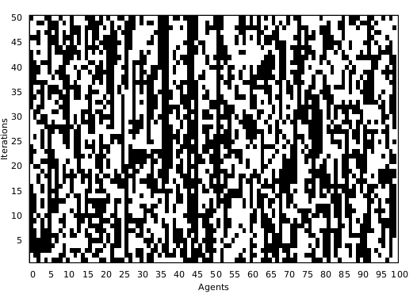
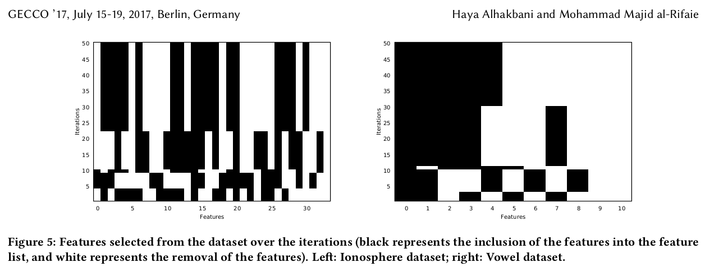

# SDS-FS

## Feature Selection using Stochastic Diffusion Search (SDS-FS)

The method introduced in this work uses stochastic diffusion search (SDS) to select the most relevant feature subset for the classification task. In this algorithm, SDS is adapted to find a suitable feature subset. Moreover, support vector machine (SVM) is used as a classifier to evaluate the predictive accuracy of each agent. The proposed method exhibits a statistically significant outperformance when compared with the performance of the classifier without the SDS-powered features selections.

## Sample agents activities

  

## Feature selection process

## Citation:
	Alhakbani, H., & al-Rifaie, M. M. (2017). Feature selection using stochastic diffusion search. In Proceedings of the Genetic and Evolutionary Computation Conference (pp. 385-392).
